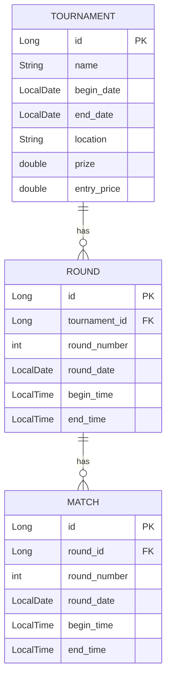

# Persistence and Data Storage

## Data Model

**Tournament**
- `id` (PK)
- `name`
- `begin_date`
- `end_date`
- `location`
- `prize`
- `entry_price`

**Round**
- `id` (PK)
- `tournament_id` (FK → Tournament)
- `round_number`
- `round_date`
- `begin_time`
- `end_time`

**Match**
- `id` (PK)
- `round_id` (FK → Round)
- `player1_id` (FK → Player)
- `player2_id` (FK → Player)
- `result`

## ER Diagram

