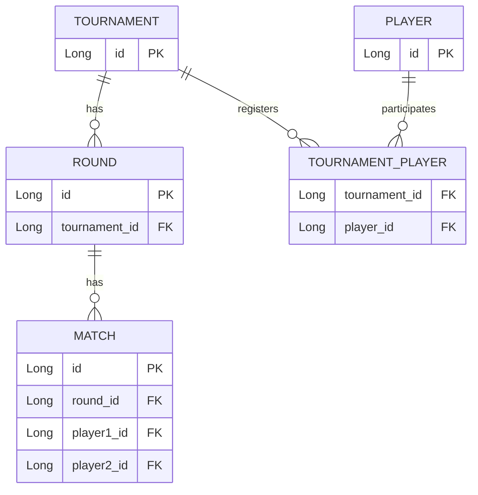

# Persistence and Data Storage

## Data Model
**Player**
- `id` (PK)
- `fullName`
- `email`
- `password`
- `points`

**Tournament**
- `id` (PK)
- `name`
- `begin_date`
- `end_date`
- `location`
- `prize`
- `entry_price`

**TournamentPlayer**
- `tournament_id` (FK → Tournament)
- `player_id` (FK → Player)

**Round**
- `id` (PK)
- `tournament_id` (FK → Tournament)
- `round_number`
- `round_date`
- `begin_time`
- `end_time`

**Match**
- `id` (PK)
- `round_id` (FK → Round)
- `player1_id` (FK → Player)
- `player2_id` (FK → Player)
- `result`

## ER Diagram

## Persistence Technology

- Spring Data JPA (Hibernate as JPA provider)
- H2 Database (development environment)
- PostgreSQL (production environment)

  
## Database Migrations

At this stage, database schema evolution is managed by Hibernate using the
`ddl-auto` configuration.

No dedicated migration tool (such as Flyway or Liquibase) is currently in use.
This may change in future versions as the data model evolves.
